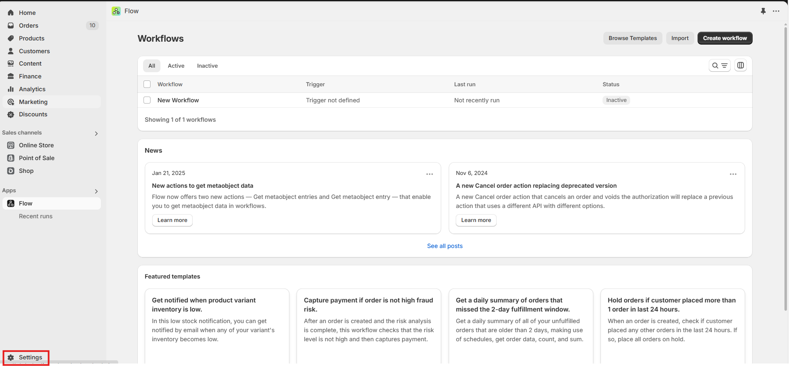
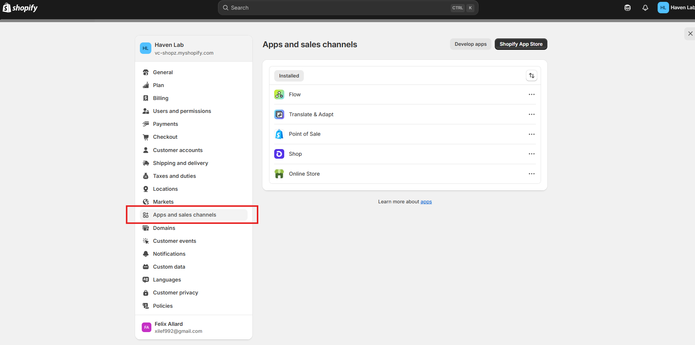
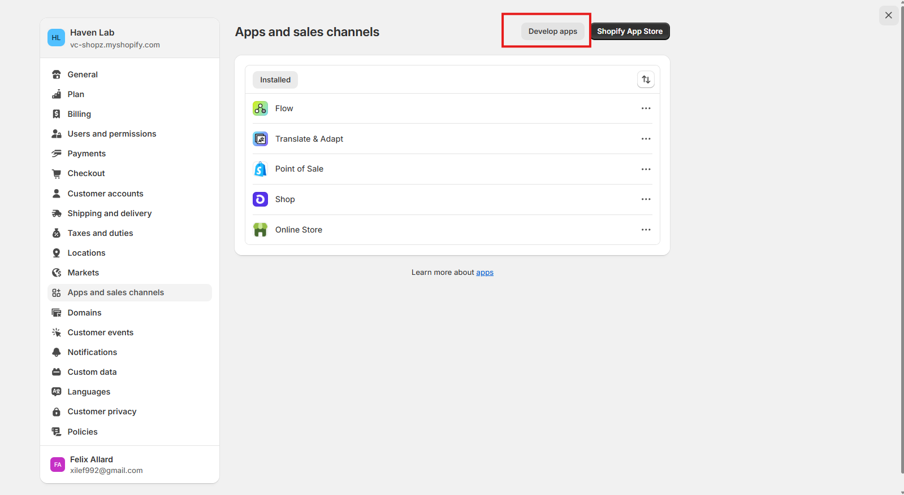
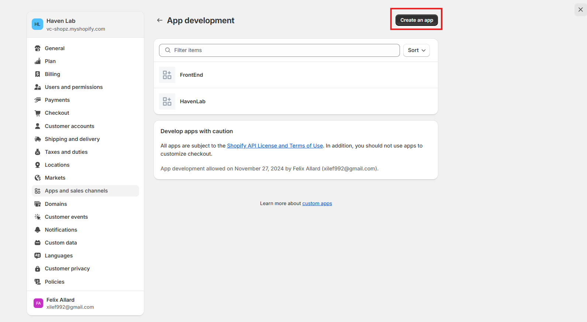
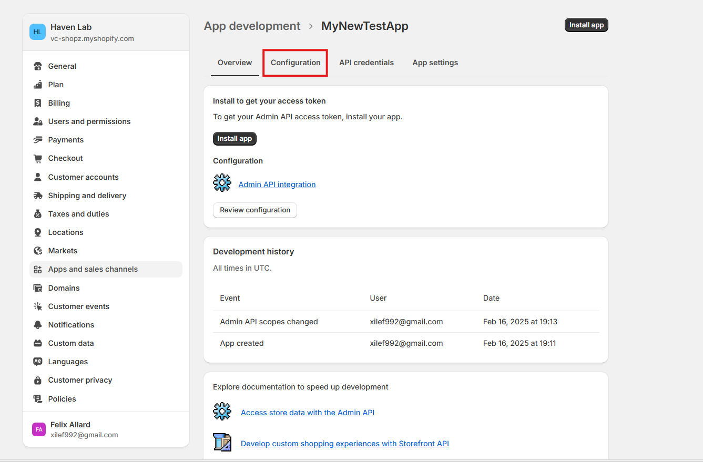
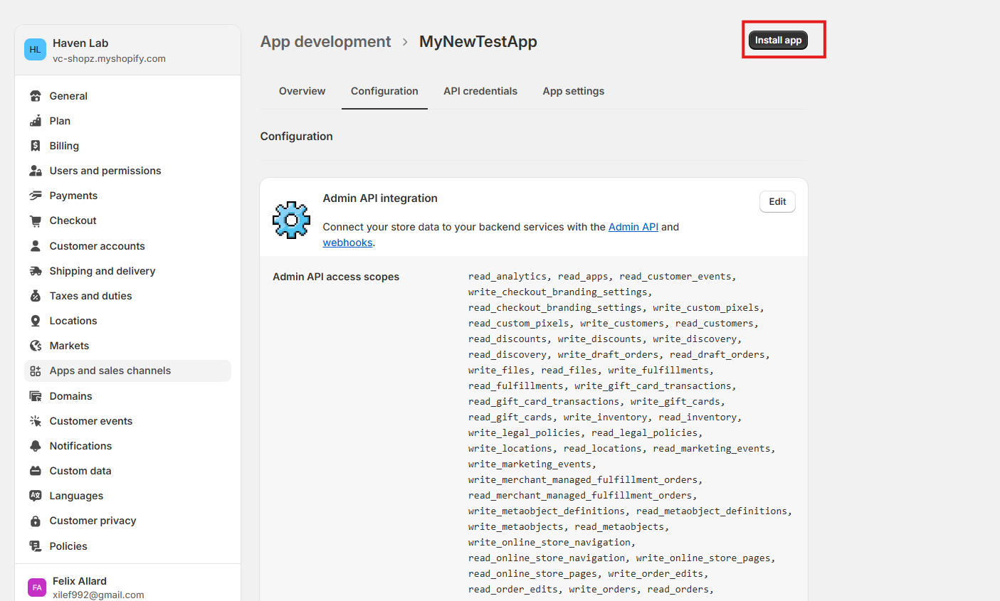
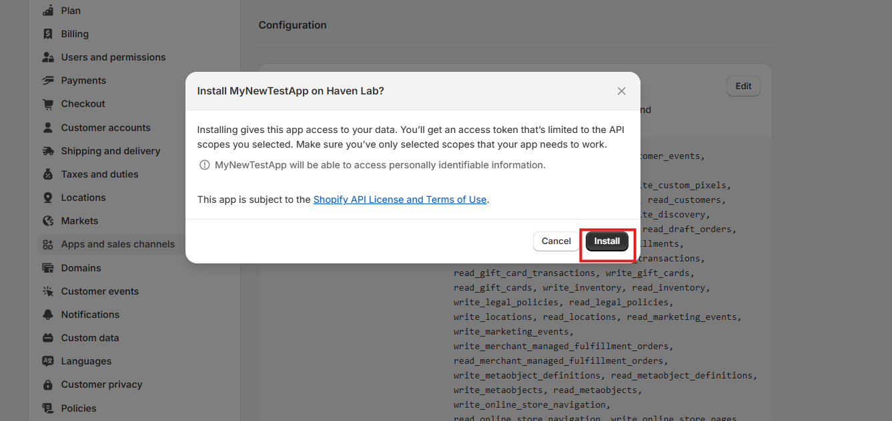
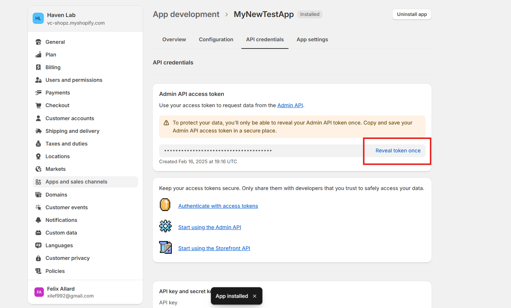
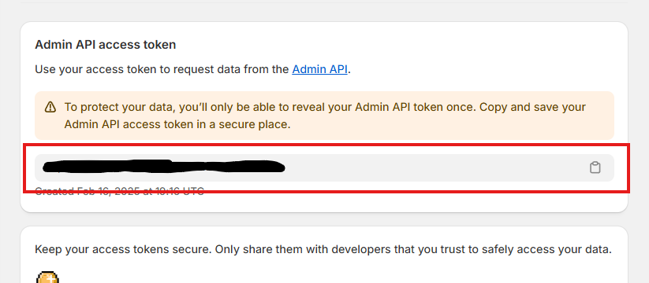

# Shopify Setup
This comprehensive guide will show you how to setup shopify with your  Haven Labs store

---

## AccessToken

### Step 1
Login into your shopify Account and go to your store. Once in your store console pannel, head in settings

### Step 2
Head in Apps and Sales Channel

### Step 3
Click on Develop apps

### Step 4
Click on Create and app

### Step 5
Click on Configuration.
Once in configuration, be sure to give all permissions to the admin token, and click on save!

### Step 6
Make sure to click on install app. This will make the app connect to your shopify store

### Step 7
Click on Install

### Step 8
Click on Reveal Token Once!
BE CAREFUL, SAVE THE TOKEN BECAUSE YOU WILL NOT BE ABLE TO SEE IT AGAIN UNLESS YOU UNISTALL AND REINSTALL THE APP

### Step 9
Save the token!
